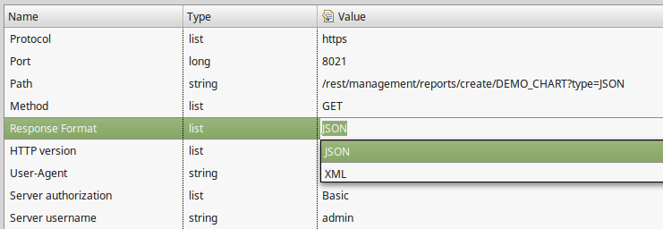
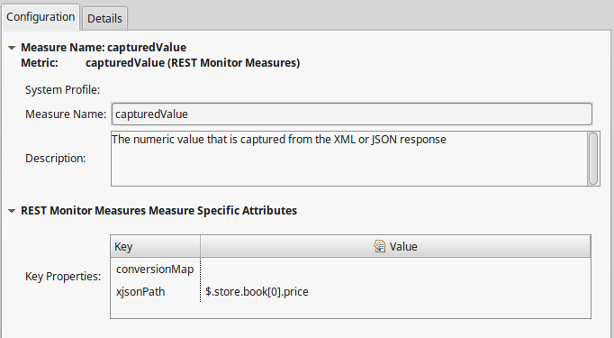

# Dynatrace-REST-Monitor-Plugin
Parses the result of an HTTP call and extracts one or more measures from the XML or JSON response

This plugin is based on the [URL Monitor Plugin](https://community.dynatrace.com/community/display/DL/URL+Monitor+Plugin+Community+Edition), so it has the same capabilities of defining the HTTP call, including authentication, proxy, ... Also the provided measures regarding the connection are the same.

In order to extract info from the response, you need to define the response format. Both XML and JSON are supported.

In addition, a new Metric "capturedValue" is available which allows you to create multiple measures of this type.

Depending on the response type you need to define an xpath or jsonpath expression to extract a resulting measure from the response. Since both XML as JSON responses are supported, the property called xjsonpath is shared.
- jsonpath: [https://github.com/jayway/JsonPath]
- xpath: [https://www.w3.org/TR/xpath/]

The result of the expression must be a numeric value. If this is not the case, the conversionMap can be used to map String values to Numeric values. It is read as a simple json object structure. For example `{"SUCCESS":0.0,"WARN":1.0,"ERROR":2.0}` or `{"true":1.0,"false":0.0}`

## Download and support
Refer to the [community page for the REST Monitor Plugin](https://community.dynatrace.com/community/display/DL/REST+Monitor+Plugin) for download and support. 

## Release notes

> **1.0.0**
> - First public version

> **1.2.0**
> - Fixes regarding Manifest config and XML support non existent nodes.

Created by `RealDolmen`.
